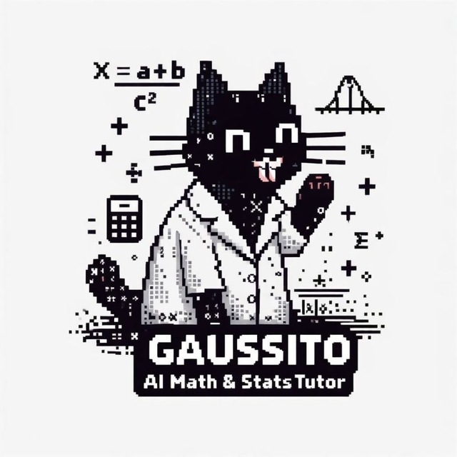

<p align="center">
  
</p>

# agente-tutor

**Gaussito**, bot de Telegram para tutorías de matemáticas y estadística: n8n + Ollama + ChromaDB.

```
cp .env.example .env
docker compose up -d
ollama pull qwen2.5:14b-instruct-q5_K_M
ollama pull nomic-embed-text
uv sync
TUTORIAS_DIR=/ruta/a/tutorias uv run python -m rag.ingestar
```

Importar `n8n/agente-tutor.json` en http://localhost:5678 y conectar la credencial de Google Calendar.
